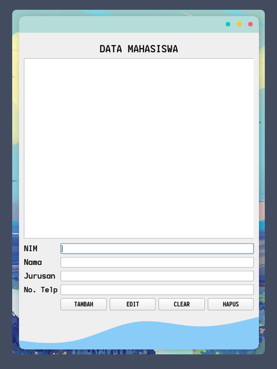

  
      

## :star: Tampilan Program Qt-Designer

## :cyclone: Tampilan Interface Aplikasi

## :point_right: Soal Nomor [1]

### Tambah Data

### Edit Data

### Clear Data

### Hapus Data

## :point_right: Soal Nomor [2]

 Kesalahannya terletak pada Indentasi <b>app.Exec();</b> Solusinya adalah dengan menghapus indentasi tersebut maka program akan berjalan dengan baik

### Hasil Running

